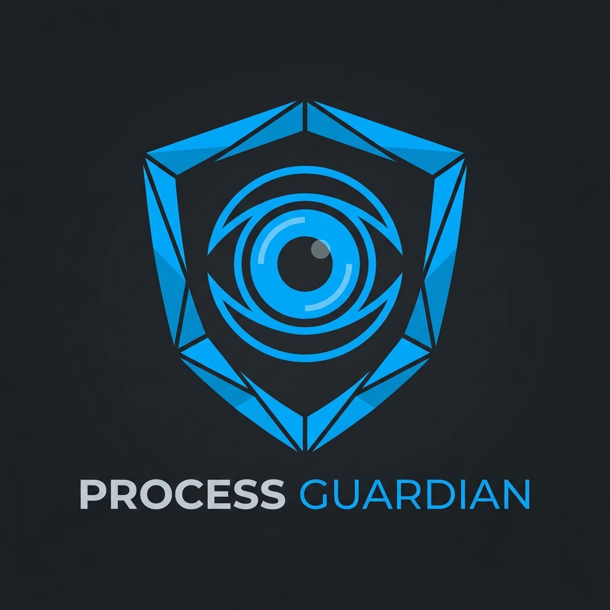
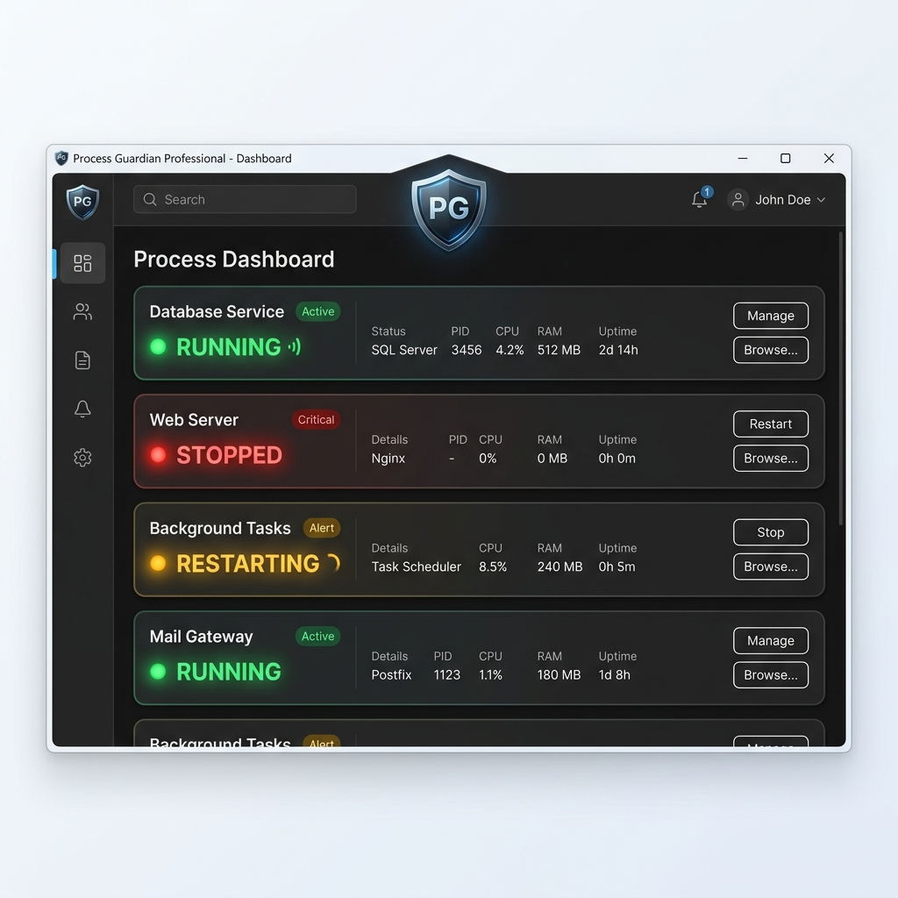

# Process Guardian Professional

  

  
  
  

---

**Process Guardian**은 Windows 환경에서 중요한 프로세스가 예기치 않게 종료되는 것을 방지하기 위해 설계된 강력하고 가벼운 프로세스 관리 도구입니다. 백그라운드에서 실시간으로 대상을 감시하며, 예외 상황 발생 시 즉각적으로 복구하여 시스템의 연속성을 보장합니다.

## 📸 Preview

  

---

> [!IMPORTANT]
> **필수 요구 사항**: 이 프로그램은 **.NET 8 Desktop Runtime**이 설치되어 있어야 작동합니다. 실행 시 오류가 발생한다면 [공식 다운로드 링크](https://dotnet.microsoft.com/download/dotnet/8.0)에서 **Windows Desktop Runtime**을 설치해 주세요.

## ✨ Key Features

- 🛡️ **실시간 프로세스 복구**: 감시 대상 프로세스가 종료되면 즉시 감지하여 자동 재실행합니다.
- 🎨 **현대적인 다크 UI**: 가독성이 뛰어나고 직관적인 카드 기반의 다크 테마 대시보드를 제공합니다.
- 🚥 **시각적 상태 점등**: 각 슬롯의 프로세스 상태(RUNNING, STOPPED, RESTARTING)를 LED 아이콘으로 즉시 확인할 수 있습니다.
- 🎈 **백그라운드 감시**: 트레이 모드를 지원하여 최소화 시에도 시스템 리소스를 최소로 사용하며 작업을 지속합니다.
- 💾 **설정 자동 보존**: 등록된 프로그램 경로를 자동으로 저장하여 재실행 시에도 설정을 유지합니다.

## 🚀 Getting Started

### Prerequisites
- .NET 8.0 Desktop Runtime
- Windows 10 / 11

### Manual
1. **프로그램 실행**: `ProcessGuardian.exe`를 실행합니다.
2. **슬롯 등록**: `Browse` 버튼을 클릭하여 감시할 실행 파일(`.exe`)을 선택합니다.
3. **자동 감시**: 경로가 등록되면 즉시 감시가 시작됩니다.
4. **최소화**: 창을 닫으면 시스템 트레이로 이동하며 백그라운드에서 계속 동작합니다.

### 📥 배포 옵션 (Download Options)
GitHub Releases에서 환경에 맞는 파일을 선택하세요:

- **Slim 버전 (`ProcessGuardian_v1.2.0_Slim.exe`)**: 용량이 매우 작지만 실행을 위해 [.NET 8 Desktop Runtime](https://dotnet.microsoft.com/download/dotnet/8.0)이 필요합니다. (권장)
- **Standalone 버전 (`ProcessGuardian_v1.2.0_Standalone.exe`)**: 용량은 크지만(약 71MB), 런타임 설치 없이 모든 PC에서 즉시 실행됩니다.

## 🛠️ Built With

- **C# / .NET Framework** - Core Logic
- **Windows Forms** - Modernized User Interface
- **Windows API** - Process & NotifyIcon management

## 📝 License

Distributed under the MIT License. See `LICENSE` for more information.

---

  Developed with ❤️ for a more stable Windows environment.

